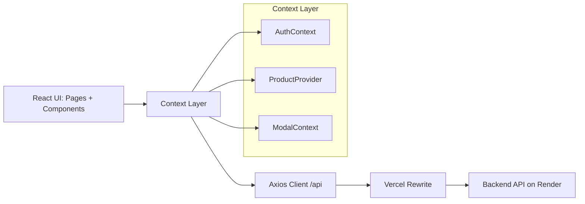

# Rajkonna Frontend

Rajkonna is a React + Vite storefront frontend for skincare products. It includes a branded landing experience, authentication modals, product discovery, product detail, cart management, profile updates, and an admin order dashboard.

Live site: `https://frontend-rajkonna.vercel.app/`

## Tech Stack

- React 19
- Vite 7
- React Router DOM 7
- Tailwind CSS 4
- Axios
- React Context API
- GSAP + React Spring + Framer Motion
- React Hot Toast

## Architecture Overview

This app follows a UI -> Context -> API client -> Backend pattern.

1. UI components/pages trigger actions (login, fetch products, add to cart).
2. Context providers (`AuthContext`, `ProductProvider`, `ModalContext`) hold shared state and action methods.
3. Actions call a shared axios instance (`src/api/axiosInstance.js`) with `baseURL: "/api"`.
4. In production, Vercel rewrites `/api/*` to the backend service.



## How UI Calls APIs

### Shared API Client

- File: `src/api/axiosInstance.js`
- Config: `baseURL: "/api"`
- Result: Every call like `api.get("/products")` becomes `/api/products`.

### Production Routing to Backend

- File: `vercel.json`
- Rewrite: `/api/(.*)` -> `https://ecommerce-backend-api-wyxt.onrender.com/api/$1`

So in production:

- Browser request: `/api/products`
- Vercel forwards to: `https://ecommerce-backend-api-wyxt.onrender.com/api/products`

### Feature to Endpoint Map

- Auth modal login/register -> `POST /api/auth/login`, `POST /api/auth/register`
- Navbar logout -> `POST /api/auth/logout`
- Product listing/search -> `GET /api/products?q=...`
- Product details -> `GET /api/products/:id`
- Add product (admin) -> `POST /api/products`
- Edit product (admin) -> `PUT /api/products/:id`
- Delete product (admin) -> `DELETE /api/products/:id`
- Cart load -> `GET /api/cart`
- Add to cart -> `POST /api/cart/items`
- Update cart quantity -> `PUT /api/cart/items/:productId`
- Remove cart item -> `DELETE /api/cart/items/:productId`
- Clear cart -> `DELETE /api/cart`
- Checkout order -> `POST /api/orders`
- Profile read/update -> `GET /api/auth/profile`, `PUT /api/auth/profile`
- Admin orders list -> `GET /api/orders?page=...&limit=...`
- Admin order details -> `GET /api/orders/:orderId`
- Admin delete order -> `DELETE /api/orders/:orderId`

## App Routes

- `/` -> Home page
- `/products` -> Product listing
- `/products/:id` -> Product details
- `/cart` -> User cart
- `/admin` -> Admin dashboard (orders)
- `*` -> Not found page

## Project Structure (High-Level)

```text
src/
   api/          # Axios client
   components/   # Reusable UI blocks and modal
   context/      # App-wide state + action providers
   data/         # Static product dataset (reference/fallback)
   lib/          # Utilities (class merge, id normalization)
   pages/        # Route-level screens
   App.jsx       # Router map
   main.jsx      # App bootstrap + providers
   index.css     # Global styling and theme tokens
```

For a file-by-file breakdown, see `about.md`.

## Setup

1. Install dependencies

```bash
npm install
```

2. Run dev server

```bash
npm run dev
```

3. Build for production

```bash
npm run build
```

4. Preview production build

```bash
npm run preview
```

## Environment Notes

- `.env` includes `VITE_API_URL=http://localhost:5000/api`
- `.env.production` includes `VITE_API_URL=https://ecommerce-backend-api-wyxt.onrender.com/api`

Important: The current axios client uses `"/api"` directly, and production relies on `vercel.json` rewrites. If you want local dev to hit backend automatically through the same `/api` path, add a Vite dev proxy or update axios baseURL to use `import.meta.env.VITE_API_URL`.

## Scripts

- `npm run dev` -> start Vite dev server
- `npm run build` -> create production bundle
- `npm run preview` -> preview production build locally
- `npm run lint` -> run ESLint
